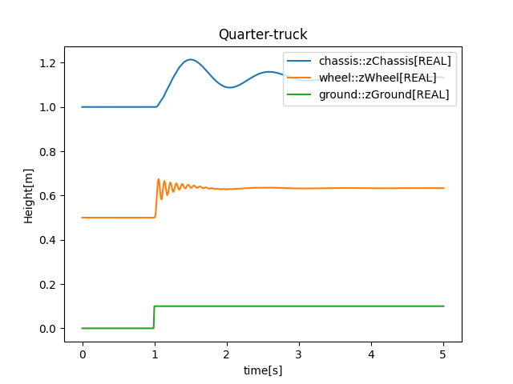

# Quarter-truck Co-simulation Demo

This repository contains SSP configurations for a Quarter-truck system to demonstrate FMI based 
Co-simulation using SSP and the Ecos co-simulation library/tool.

### Download Ecos CLI

Download the latest version of Ecos-cli from [GitHub](https://github.com/Ecos-platform/ecos/releases)

Either:
* Add the executable to PATH or; 
* Place it in this folder. 

### Run demo

To run the demo, execute the `run.bat` script within the `/scripts` folder. 
Modify the script as needed.
A file `quarter_truck.csv` should appear containing key information from the simulation run.

#### Plotting feature
Invoking `run_with_plotting.bat` will additionly display a graph of the results. 
This feature requires Python3 and the following libraries:
* matplotlib
* pandas

The result should look like this:

